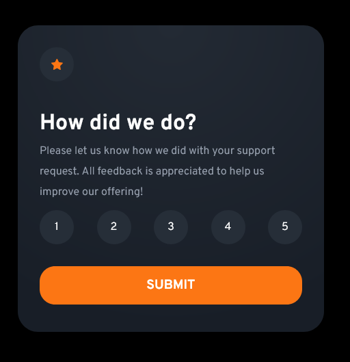

# Frontend Mentor - Interactive rating component solution

This is a solution to the [Interactive rating component challenge on Frontend Mentor](https://www.frontendmentor.io/challenges/interactive-rating-component-koxpeBUmI). Frontend Mentor challenges help you improve your coding skills by building realistic projects.

## Table of contents

- [Overview](#overview)
  - [The challenge](#the-challenge)
  - [Screenshot](#screenshot)
  - [Links](#links)
- [My process](#my-process)
  - [Built with](#built-with)
  - [What I learned](#what-i-learned)
  - [Useful resources](#useful-resources)
- [Author](#author)

## Overview

This is an interactive rating component built using react.js and vanilla css.

### The challenge

Users should be able to:

- View the optimal layout for the app depending on their device's screen size
- See hover states for all interactive elements on the page
- Select and submit a number rating
- See the "Thank you" card state after submitting a rating

### Screenshot

### Links

- Solution URL: (https://github.com/Generalsoi/interactive-rating-component)
- Live Site URL: (https://interactive-rating-component-generalsoi.vercel.app/)

## My process

### Built with

- Vanilla CSS
- Flexbox
- [React](https://reactjs.org/) - JS library
- React router v6

### What I learned

I learned about proper react routing using v6. I also learned that useNavigate now replaces useHistory in the react router v6.

One of the important things I learned also while working on this project was passing props properly down different child components.

I ran into a bit of a bug, but I eventually fixed it.

### Useful resources

- [React Router v6 documentation](https://reactrouter.com/docs/en/v6/getting-started/overview) - This helped me while trying to set up react routing for my project.
- [An article explaining react onClick event handling.](https://upmostly.com/tutorials/react-onclick-event-handling-with-examples) - This is an amazing article which helped me understand the react onClick event handling properly while I was working on this project.

## Author

- Website - [Success Ikhinobele](https://www.github.com/Generalsoi)
- Frontend Mentor - [@Generalsoi](https://www.frontendmentor.io/profile/Generalsoi)
- Twitter - [@Successsoi1](https://www.twitter.com/Successsoi1)
